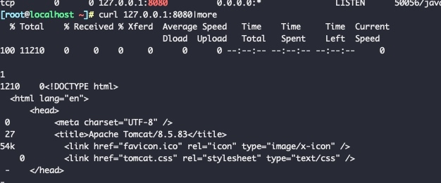
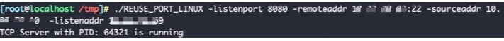
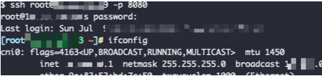

## portreuse reuseport 端口复用

## Usage

```
go run main.go -listenport 8080 -remoteaddr 127.0.0.1:22 -sourceaddr 112.65.12.104 -listenaddr 172.19.0.2
```

```
-listenport 想要复用的本地端口，该端口不能监听在0.0.0.0，最好监听在127上
-remoteaddr 把流量转发到的目的IP和端口
-sourceaddr 远程IP，只有该IP过来的才会走端口复用
-listenaddr 想要复用的本地IP，建议把该值设置为本地内网IP
```
上面的命令含义为：当来源IP为112.65.12.104时，会把访问8080端口的流量转发到本地的22端口上。

## 实操

1、目标服务127监听着8080 tomcat服务：



2、开启端口复用，监听内网网卡：




3、外部访问8080端口，成功访问到另外一台机器的ssh：



